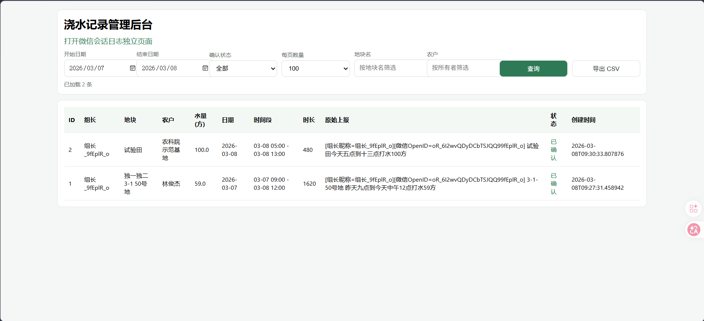
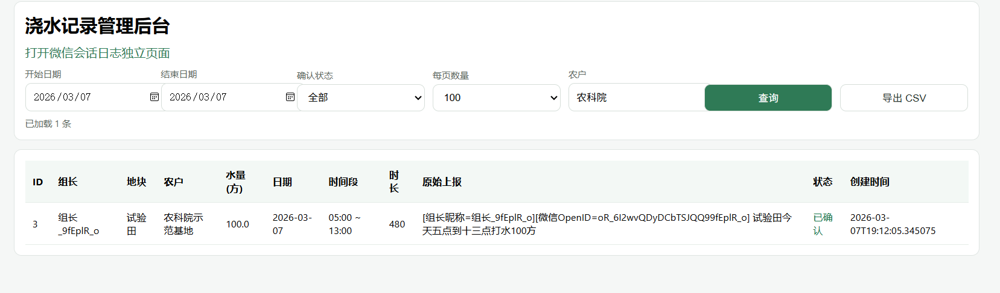
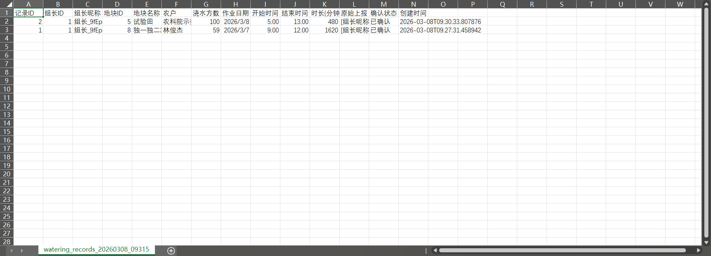
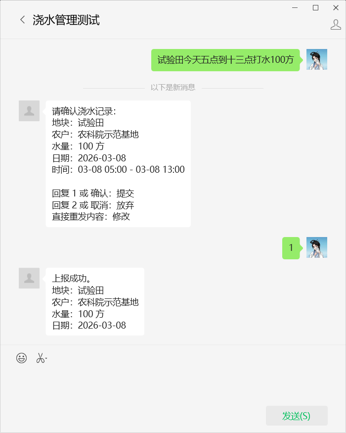

# 微信智能浇水上报系统

基于 FastAPI + SQLite 的微信公众号浇水上报系统，支持自然语言上报、确认提交流程、后台查询导出、微信会话日志追踪。

## 功能概览

- 微信回调：`GET/POST /wechat/callback`
- 上报解析：本地规则优先，必要时调用大模型（OpenAI / 智谱 / 通义 / DeepSeek）
- 确认流程：回复 `1/确认` 提交，回复 `2/取消` 放弃
- 数据持久化：SQLite（不依赖 Redis）
- 管理后台：浇水记录查询、按地块名/农户筛选、CSV 导出
- 日志后台：`/api/v1/admin/log` 独立展示微信会话日志
## 待办功能
- 暂未能获取到真实用户昵称和相关信息，需添加自定义菜单和相关的登录页面
## 页面截图

### 管理后台（浇水记录）



### 条件筛选



### 导出示例



### 微信会话



## 目录结构

- `app/`：后端代码
- `data/`：SQLite 数据库与示例 CSV
- `scripts/`：初始化、启动、自检脚本
- `docs/`：系统设计与对接文档
- `logs/`：运行日志（`logs/app.log`）

## 环境要求

- Python 3.10+
- Windows PowerShell 或 Linux/macOS Shell
- 公众号服务器配置权限（生产环境需 HTTPS）

## 配置方式

- 主要编辑：`.env`
- 配置映射：`config.yaml`
- 脱敏示例：`.env.example`

当前配置加载方式是：先读取项目根目录 `.env`，再解析 `config.yaml` 中的 `${ENV_NAME:-默认值}` 占位。
建议流程：复制 `.env.example` 为 `.env` 后填写真实密钥；日常只改 `.env`。

## 快速启动

```bash
pip install -r requirements.txt
python scripts/init_db.py
uvicorn app.main:app --host 0.0.0.0 --port 8000
```

启动后可访问：

- 根路径：`http://127.0.0.1:8000/`
- 健康检查：`http://127.0.0.1:8000/api/v1/health`
- 回调验活：`http://127.0.0.1:8000/wechat/callback`
- 记录后台：`http://127.0.0.1:8000/api/v1/admin/dashboard`
- 日志后台：`http://127.0.0.1:8000/api/v1/admin/log`

## 一键初始化 + 启动

### Windows

```powershell
powershell -ExecutionPolicy Bypass -File .\scripts\start_local.ps1
```

常用参数：

- `-SkipInstall`：跳过依赖安装
- `-KillPort`：启动前清理占用 `8000` 的进程
- `-Reload`：开发热更新模式
- `-ResetDb`：重建数据库（会清空历史数据）

示例：

```powershell
powershell -ExecutionPolicy Bypass -File .\scripts\start_local.ps1 -SkipInstall -KillPort
```

### Linux/macOS

```bash
sh scripts/start_local.sh
```

环境变量：

- `RELOAD=1`：启用热更新
- `RESET_DB=1`：重建数据库（会清空历史数据）

示例：

```bash
RELOAD=1 sh scripts/start_local.sh
```

## 微信公众号配置

在公众号后台「开发与接口管理 -> 基本配置 -> 服务器配置」填写：

- URL：`https://你的域名/wechat/callback`
- Token：必须与 `.env` 中的 `WECHAT_TOKEN` 完全一致
- EncodingAESKey：与配置一致（联调阶段可先明文模式）

注意：

- 回调地址必须公网可达且 HTTPS 有效
- 正式运行建议关闭 `--reload`
- Token 不一致会报 `verify token fail`

## 主要接口

- `GET /api/v1/admin/dashboard`：浇水记录后台页面
- `GET /api/v1/admin/log`：微信会话日志页面
- `GET /api/v1/records`：记录查询
- `GET /api/v1/records/export`：CSV 导出
- `GET /api/v1/chatlogs`：微信会话日志查询
- `GET /api/v1/statistics`：统计
- `GET /api/v1/health`：健康检查

## 常见问题

### 1) `/wechat/callback` 访问失败

先本机检查：

```bash
python scripts/check_wechat_callback.py
```

再做公网检查：

```bash
python scripts/check_public_wechat.py --url https://你的域名/wechat/callback
```

### 2) 微信发消息无回复

按顺序排查：

1. 公众号后台 URL/Token/加密模式是否一致
2. 域名 DNS、TLS、隧道/反代是否正常
3. 服务是否稳定运行（避免频繁重启）
4. 查看 `logs/app.log` 和 `/api/v1/admin/log`

### 3) 启动报端口占用（WinError 10048）

```powershell
powershell -ExecutionPolicy Bypass -File .\scripts\start_local.ps1 -SkipInstall -KillPort
```

### 4) 一次上报出现两条记录

已优化：待确认阶段若收到同一条重复文本，仅重发确认提示，不会重复建记录。

## 安全建议

- 不要把真实 `.env` 提交到仓库
- 不要把真实 `app_secret`、`api_key` 写回 `config.yaml`
- 通过 `.env` 注入敏感信息
- 生产环境启用 HTTPS、访问控制和备份策略

## 相关文档

- `docs/system_design.md`
- `docs/backend_implementation.md`
- `docs/wechat_integration.md`
